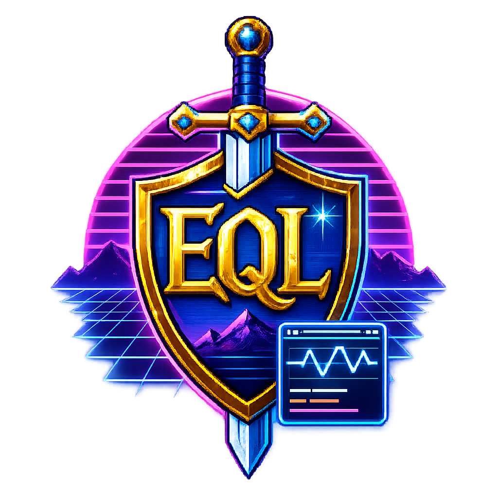

<p align="center">
  
</p>

# EQL Log Reader

Always-on-top overlay tools for **EverQuest Legends**, driven entirely by the
game's own log file (`eqlog_<Name>_<Server>.txt`). No injection, no memory
reading, no game files touched — the tools just tail the log the game already
writes, so they're safe to run alongside the game.

> **Windows SmartScreen note:** the installer is not yet code-signed, so
> Windows may warn that it "isn't commonly downloaded" (browser) and show
> "Publisher: Unknown" (installer). That's the standard warning for any
> unsigned download, not a detection of anything harmful — the tools only
> read the game's log file, and the full source is this repository, so you
> can audit or build it yourself (see BUILDING.md). To proceed: choose
> **Keep** on the download, then **More info → Run anyway** at install.
> Code signing to remove the warning entirely is in progress.

## The tools

**Launcher** (`eql_launcher.py`) — control panel. Auto-detects every
character in the default Daybreak install, pick one, then start/stop each
overlay with a click.

**Friends Overlay** (`eql_friend_overlay.py`) — live friends list with
level, class combo, race, zone, and AFK detection. Non-friend `/who`
searches never pollute the roster and can pop up in their own window.
Per-character rosters persist between sessions. Both the list and the
/who window minimize to their title bars; the minimized list's bar
flashes when a friend comes online, goes offline, or flips AFK.

**DPS/HPS Meter** (`eql_dps_meter.py`) — retro live combat meter: DPS, HPS,
DTPS with melee/ranged/spell/poison/song/damage-shield splits, damage
sources split up to eight ways (Melee / Skill / Ranged / Spell / Poison /
Song / DS / Pet — rows follow your build: only sources your `/who` class
combination and damage history actually use are shown), your pet tracked
as its own actor, accuracy/crit/biggest-hit, kill rate, stance &
invocation tracking, and a persistent ALL TIME block (lifetime accuracy,
crits, biggest hit, kills, and share of combat time per
stance/invocation) kept **per build** — change your class combination and
the meter saves one build's lifetime stats and loads the other's. A
BUFFS block lists the buffs/debuffs currently on you with estimated
countdowns (durations from the spell file; the log's buff lines carry no
spell name, so they're attributed via `spells_us_str.txt` messages),
scrollable with the mouse wheel when more are up than fit. Rates divide by
*active* combat time — downtime between chained pulls is capped out, so the
numbers reflect how hard you actually hit. Right-click for options: themes,
vertical/horizontal layout, fight-average vs rolling 10s/30s windows,
DPS vs DPM units, combat timeout (5–60s), size, opacity, and the buff
block on/off.

**Session Report** (`eql_session_report.py`) — deep-dive companion:
damage/healing by ability with category filter and search, bar-chart graphs
(damage by ability, DPS per fight), session-vs-session comparison with
best-session stars and a Build column/filter (each session is tagged with
the `/who` class combination it ran under, so builds can be compared
against each other), persistent personal records, stance/invocation
performance, spells cast (mana/cast/recast/duration from `spells_us.txt`,
plus per-spell resist counts and fizzle/interrupt totals), buff/debuff
uptime on you (log lines like "You feel armored." carry no spell name — the
report attributes them via the game's own `spells_us_str.txt` message
table), and an unrecognized-line calibration tab.

**Atlas Collector** (`eql_atlas.py`) — cartography companion: builds your
personal loot/spawn database as you play, entirely from the log. Every
kill, drop (EQL auto-loot names the mob, so attribution is exact), corpse
coin, and death is recorded — placed on the map whenever a recent `/loc`
is available. First launch imports your ENTIRE existing log history;
afterwards a saved log position means restarts only catch up (nothing is
double-counted). Ships with an optional **baseline** layer
(`eql_atlas_baseline.json.gz`, distilled from the public Project Quarm
database — same EQMacEmu lineage as EQL): expected drop rates, named-mob
spawn points, and respawn timers your own play then confirms, contradicts,
or extends (drops the baseline doesn't know are flagged ★NEW). Includes a
**map window** (right-click the panel → Map window): Brewall-compatible
zone maps with pan/zoom, an orbitable **3D view** built from the map
files' true z data, per-story floor filter, auto-follow, chroma-key ghost
mode, death marks, hover cards on every pin (drops + percentages), and a
**guide** that routes you to any item — A* along the map's own geometry
in-zone, zone-by-zone directions across the world. A **search bar** (and a
private in-game chat channel — see setup below) drives it all:
`find <item|NPC>`, `guide <item|NPC>`, `note <text>`, `fav <item>` —
find and guide match **mobs, NPCs, and named** as well as items: your own
kill spots and the baseline's spawn points are targets too, so
`guide Beek Guinders` walks you to the quest giver and `find <named>`
rings its spawn points. Once you're in the target zone the panel names
what you're looking for — `from: <the mobs that drop it>` for items,
and `quest: hand in to <NPC>` / `still need: ...` for a tracked quest.

New in v1.8, the Atlas gains a **Quest window** (right-click the panel →
Quest window): a per-character quest companion built on a distilled copy
of the Project Quarm quest scripts (~3,300 recognizable item turn-ins).
**Search** quests by name, NPC, zone, or any required/reward item —
results honor the same Expansions locks as the rest of the Atlas — and
add them to a persistent **My Quests** list. The detail pane shows the
hand-in NPC and zone, every required item with live `[have/need]`
progress, **where each item drops** (your own observed loot first, then
the baseline's best rates), the reward (choose-one rewards included),
and the NPC's success dialogue. Item progress counts up **automatically
from your loot lines** — only loot picked up after you added the quest
counts, and `＋`/`－` buttons correct for items you already had or handed
away. **Track** a quest and its still-missing items ring their known
drop spots on the Atlas map in violet (the `quest` layer), and the
**hand-in NPC gets a labeled violet pin** at its spawn point whenever
you're in its zone; **Guide** routes you to an item's nearest source and
**Hand-in** to the quest NPC via the Atlas guide — both are toggles, and
the window's status line keeps a live readout (distance re-ranges as you
move, zone route while traveling) until you toggle the guide off.
**Clear ▶** drops only the tracked quest — the rest of the list stays. Quest data is Quarm's;
EQL availability may differ — but the moment your log shows an NPC
speaking a quest's hand-in success dialogue (imported history included),
that quest is flagged **✔ confirmed on EQL**, permanently, per
character. Everything else is "probably right until your own play proves
otherwise", the same deal as the loot baseline.

Shared library code (not run directly): `eql_overlay_common.py` (log
tailing, settings, themes), `eql_combat_tracker.py` (the combat parser),
`eql_spell_db.py` (spells_us.txt reader), `eql_atlas_map.py` (the Atlas
map window), `eql_quest.py` (the Atlas quest window).
`eql_atlas_baseline_build.py` and `eql_quest_db_build.py` are dev tools
that regenerate the loot baseline and quest database from a Quarm
database dump / quest-script checkout.

## Themes

One shared theme set across all five applets: **16-bit Window** (the
default), CRT Terminal, Arcade LED, Vintage (text-only rows), and
**Neon HUD** — a fully transparent mode where black-outlined neon text
floats directly over the game (Windows; the report and launcher render it
as a plain dark palette). Pick a theme from each applet's right-click menu
(overlays), the Theme dropdown (Session Report), or the Theme button
(Launcher).

## In-game setup (Atlas Collector)

The Atlas works read-only out of the box, but two in-game habits unlock
all of it:

**1. Positions — `/loc`.** The log only knows where you are when `/loc`
runs. Fold one into a hotbutton you already spam (attack, taunt, a nuke)
and every kill/drop/death lands on the map; without it, events still
count, just unplaced. The map's live marker, trail, floor auto-filter,
and guide line all key off it.

**2. Commands — a private chat channel.** Commands ride a password-
protected channel only you are in. Per character, per machine:

1. `/log on`, and confirm the log has **timestamps** (lines must start
   with `[Tue Jul 21 ...]` — enable chat timestamps in Options if not).
   Without timestamps the Atlas ignores every line.
2. `/join <name>:<password>` — letters/numbers only, e.g.
   `/join mirandacmd:swordfish`. Use a **throwaway password** (it appears
   in plaintext in your own log) and a **different channel per
   character** — the tool locks commands unless the channel has exactly
   one member, so two characters sharing one channel lock each other out.
3. `/autojoin <name>:<password>` — **the critical step**: its
   confirmation line is what the Atlas learns your channel from (and it
   re-joins you every login).
4. `/list` — must show `(1)` after your channel name. The panel flips
   from `cmd [...] LOCKED` to `cmd [...] ready`.
5. Talk to the tool with `/1 find batwing` (the channel slot number from
   `/list`), or set the channel as your chat window's default and type
   commands bare. `help` lists them: `find`, `guide`, `clear`, `note`,
   `fav`.

Safety model: only YOUR messages ever parse (the log renders you as
"You tell..." and everyone else as "<Name> tells..." — impersonation is
structurally impossible); commands lock the instant anyone else speaks in
the channel and stay locked until `/list` shows one member again; public
channels, says, tells, and group chat are never parsed. The panel's
search bar accepts the same commands without any channel at all.

## In-game setup (Friends Overlay)

**Before anything else, turn on logging:** type `/log on` in any in-game
chat window. This is what makes the game write `eqlog_<Name>_<Server>.txt`
in the first place — every tool in this suite reads that file, so nothing
here works until logging is on. Logs are written to your EverQuest Legends
install's `Logs` folder.

The Friends Overlay reads `/who` and friend-list output from the game's log,
so it needs a dedicated chat tab plus a macro/hotkey that refreshes that data
for you automatically.

1. Open any chat window and create a new tab.
2. Route all `/who` messages and "Other" messages to that tab.
3. Turn off highlighting on new messages for that tab, so it doesn't flash/alert.
4. Press `L` to open Socials.
5. Create a new macro: `/friend | /who friend all | /pet who leader | /pause 60 | /who`.
   (The trailing `/pause 60 | /who` runs a plain `/who` six seconds later —
   that's what reveals your own level to the log, which the duration
   estimates scale by.)
   
6. Place the macro in the last slot of your main hotbar (slot 12) — any slot
   works, this is just what the rest of these steps assume.
7. Press `Alt+O` to open Settings, then go to Controls > Hotbar 1 > Button 12
   (or whichever slot you used).
8. Rebind that button to one of your movement keys (e.g. Right / D).
9. Pressing that movement key now also fires the macro into the hidden chat
   tab, refreshing friend/pet data every time you move that direction.
10. Press that direction any time you want to update the friends list.
    `/who` results also pop up in their own window — right-click the main
    overlay element and give it a try.

## Requirements

- **Windows 10 or later** for the installer build (the overlays use
  Windows-specific transparency; running from source on Linux/macOS works
  for the Session Report and Launcher, with overlays falling back to
  plain dark windows).
- **EverQuest Legends with logging on**: type `/log on` in-game once per
  character — every tool reads `eqlog_<Name>_<Server>.txt` from your
  install's `Logs` folder. Log **timestamps must be enabled** (lines must
  start with `[Tue Jul 21 ...]`; see chat Options if they don't).
- **Nothing else for the installed build** — the installer ships
  everything, no Python required.
- Building or running from source: **Python 3.8+ with tkinter** (included
  in the standard Windows Python installer). No third-party packages.
- Optional, feature-unlocking extras: `spells_us.txt` / `spells_us_str.txt`
  from your EQL install (spell/buff features — found automatically),
  Brewall's map pack in `maps\brewall\` (Atlas map rendering), a `/loc`
  hotbutton (map positioning), and a private chat channel (Atlas commands
  — setup below).

## Running

Python 3.8+ with tkinter (included in the standard Windows Python
installer). No third-party packages.

```
python eql_launcher.py
```

or run any tool directly, e.g.
`python eql_dps_meter.py "C:\...\Logs\eqlog_Name_server.txt"`.

## Notes on accuracy

Log-line formats were calibrated against real gameplay logs; anything the
parser doesn't recognize lands in the "Unrecognized lines" tab (Session
Report) or the meter's calibration window rather than being silently
dropped — check there first if a number looks off. Stance/invocation
*effects* come from eqlwiki.com; spell magnitude and buff-duration
estimates use classic-era EQEmu reference math and are labeled as
estimates in the UI. Spell-file mechanics (song/lifetap/discipline flags,
target and resist types, the full SPA effect table, buff message strings,
wiki-verified spell lists) follow the reverse-engineered format documented
by the EQL Spell Explorer project (github.com/Amerzel/eql-info).

The spell-data features read `spells_us.txt` / `spells_us_str.txt` from
your EQL install (found automatically); without them those features
quietly degrade while combat parsing works as normal. Duration estimates
scale by your character level once the log reveals it via a plain `/who`
(`/who friend all` alone does not include yourself — the recommended
macro above ends with `/pause 60 | /who` precisely so firing it pins
your level automatically); until then estimates assume L50.

Settings, rosters, personal records, and all-time stats are stored as JSON
files next to the scripts and are intentionally not part of this
repository.

## License

MIT — see [LICENSE](LICENSE).
